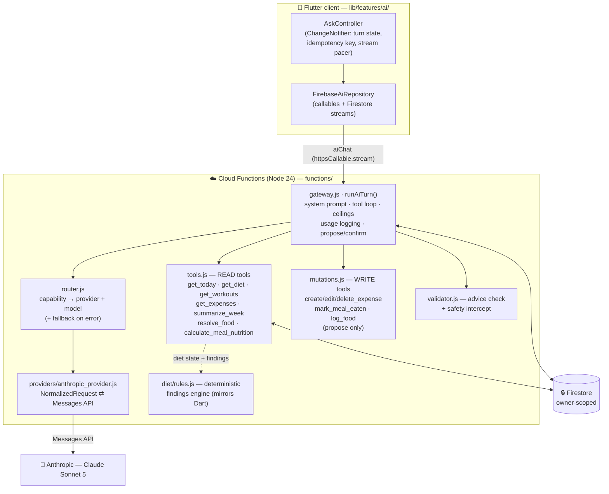
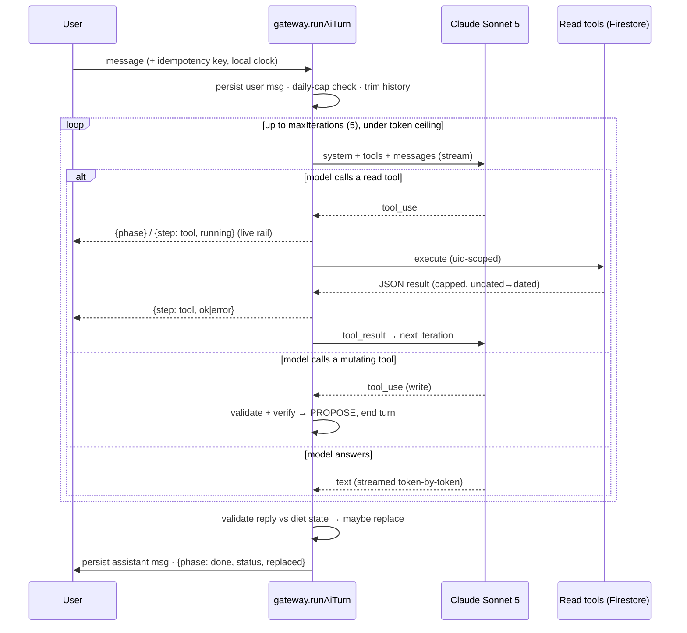
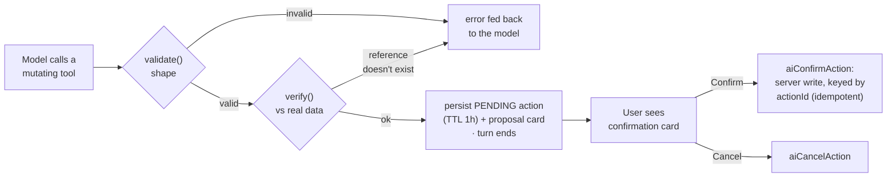

<div align="center">


# ZIVO

### The gym tracker with a coach that knows your numbers.

An AI-powered training tracker — guided sessions, progressive-overload analysis, and an<br/>
assistant that reads your own splits, sets, and body-weight — with diet, a workout music
companion, and moments along for the ride.

[](#getting-started)
[](https://flutter.dev)
[](https://firebase.google.com/products/functions)
[](firestore.rules)
[](#the-ai-system)
[](#quality-gates)

</div>

---

## Table of contents

- [Why ZIVO](#why-zivo)
- [The six areas](#the-six-areas)
- [Technology stack](#technology-stack) — *exact languages, frameworks, libraries, models, APIs*
- [The AI system](#the-ai-system) — *the architecture that makes ZIVO interesting*
  - [At a glance](#at-a-glance)
  - [Provider abstraction &amp; capability routing](#1-provider-abstraction--capability-routing)
  - [The "Ask" agentic loop](#2-the-ask-agentic-loop)
  - [The system prompt &amp; prompt caching](#3-the-system-prompt--prompt-caching)
  - [Read tools](#4-read-tools-uid-scoped-never-mutate)
  - [Two-phase confirmed writes](#5-two-phase-confirmed-writes-proposeconfirmexecute)
  - [The coach doesn't decide — the rules engine does](#6-the-coach-doesnt-decide--the-rules-engine-does)
  - [The advice validator &amp; safety intercept](#7-the-advice-validator--safety-intercept)
  - [Nutrition resolution — one server path to a calorie](#8-nutrition-resolution--one-server-path-to-a-calorie)
  - [Structured extraction — PDF / photo / voice → a real plan](#9-structured-extraction--pdf--photo--voice--a-real-plan)
  - [Speech-to-text](#10-speech-to-text-input-only)
  - [Cost governance, idempotency &amp; time](#11-cost-governance-idempotency--time)
  - [The proactive weekly coach](#12-the-proactive-weekly-coach)
- [Application architecture](#application-architecture)
- [Project structure](#project-structure)
- [Getting started](#getting-started)
- [Quality gates](#quality-gates)
- [Documentation](#documentation)
- [Security &amp; privacy](#security--privacy)

---

## Why ZIVO

Most training apps are a log with a chatbot bolted on. ZIVO is built the other way around:
an AI coach that actually knows your numbers — your splits, your logged sets, your
body-weight trend, your diet — wrapped in guided live sessions and progression analysis,
in one warm, dark, calm design so checking in takes seconds, not willpower.

It is built **private-first**: your content lives in your account, the AI only ever acts on
*your own* data, backups go to *your own* Google Drive, and nothing is sold or used to train
third-party models. The coach's writes are always **proposed and confirmed** — it never
silently changes your data.

## The six areas

ZIVO's design system assigns one color to each area of life — the same dots you'll see in the app:

| | Area | What it does |
|---|---|---|
|  | **Today &amp; Hub** | A single home for what's next — training, meals, spending, moments, and a step-count move ring at a glance. |
|  | **Workout** | First-class splits, guided live sessions, body-weight tracking, progressive-overload analysis, and PDF plan import. |
|  | **Diet** | Editable meal plans, a daily "did I eat this" ledger, a server-side nutrition catalog, and AI plan import / generation. |
|  | **Expenses** | An append-only spending log with a running wallet balance and custom categories. |
|  | **Ask AI** | A tool-mediated coach over *your own* data — streaming answers, propose-and-confirm writes, and voice input. |
|  | **Moments** | Photos and small memories, local-first, backed up to your own Google Drive. |

Cross-cutting: email-code verification, Sign in with Apple / Google / password, a Spotify
now-playing companion, offline-first persistence, Arabic + English (RTL-aware), and full
media backup.

---

## Technology stack

Everything below is actually used in the codebase. Framework-wide staples (Flutter, Dart,
Firebase) are named once; the interesting specifics — the AI models, the SDKs behind them,
and the non-obvious libraries — are called out explicitly.

### Languages

| Language | Where |
|---|---|
| **Dart** (SDK `^3.12.2`) | The entire Flutter app (`lib/`) |
| **JavaScript** (Node **24**, CommonJS) | Cloud Functions backend (`functions/`), including all AI orchestration |
| **Firestore Security Rules** (CEL-like DSL) | `firestore.rules` — deny-by-default, per-collection field validation |
| **ARB** (`intl` message format) | Localization catalogs (`lib/l10n/app_en.arb`, `app_ar.arb`) |

### AI models, APIs &amp; SDKs

| Model | Provider &amp; API | SDK | Used for |
|---|---|---|---|
| **Claude Sonnet 5** (`claude-sonnet-5`) | Anthropic **Messages API** (streaming, tool use, **prompt caching**, native document + image input) | [`@anthropic-ai/sdk`](https://www.npmjs.com/package/@anthropic-ai/sdk) `^0.32` | The "Ask" coach loop, PDF/photo plan import, diet-plan generation |
| **Gemini Flash** (`gemini-flash-latest`) | Google **Gemini API** — multimodal `generateContent`, inline base64 audio, thinking disabled, `temperature: 0` | [`@google/genai`](https://www.npmjs.com/package/@google/genai) `^2.18` | Speech-to-text (**default** route) |
| **GPT-4o mini transcribe** (`gpt-4o-mini-transcribe`) | OpenAI **Audio Transcriptions API** | [`openai`](https://www.npmjs.com/package/openai) `^7.5` | Speech-to-text (**optional fallback**, tried only if Gemini errors) |

> The model IDs and their provider/route live in one place each —
> [`functions/ai/routing/router.js`](functions/ai/routing/router.js) (LLM capabilities) and
> [`functions/ai/speech/routing/speech_router.js`](functions/ai/speech/routing/speech_router.js)
> (speech-to-text). Nothing else in the codebase hardcodes a model.

### Client — Flutter app (`lib/`)

| Area | Packages / approach |
|---|---|
| **Framework** | Flutter · Dart · Material (dark), Cupertino icons |
| **State &amp; DI** | *No* heavyweight framework by design — plain `setState` + `Stream`s + an `AppScope` `InheritedWidget` seam, with a plain `ChangeNotifier` controller where a screen's rules outgrow `setState` (ADR-008). No `go_router` / `riverpod` / `bloc` / `provider` / `get_it`. |
| **Backend SDKs** | `firebase_core`, `firebase_auth`, `cloud_firestore`, `cloud_functions` |
| **Auth** | `google_sign_in`, `sign_in_with_apple`, email + password (with email-OTP), `crypto` |
| **Media pipeline** | `image_picker`, `image_cropper` (uCrop/native), `gal` (save to Photos), `path_provider`, `path`, `file_picker` (PDF); Google Drive backup via `googleapis` (Drive v3, `drive.file` scope) + `http` |
| **Voice** | `record` — captures the mic note that `aiTranscribe` turns into text |
| **Music companion** | `spotify_sdk` (App Remote) + `palette_generator` (album-art color-adaptive Now Playing screen) |
| **Sensors** | `pedometer` (Today's move ring) |
| **Design system** | `google_fonts` (three families only — Manrope / Azeret Mono / Instrument Serif, per ADR-009), `lucide_icons_flutter`, `lottie`, custom spring-physics motion tokens |
| **Localization** | `flutter_localizations` + `intl` (Arabic + English, RTL-aware) |
| **Prefs** | `shared_preferences` (per-device Drive connection state) |
| **Testing** | `flutter_test`, `fake_cloud_firestore` (in-memory Firestore fake) |

### Backend — Cloud Functions (`functions/`)

| Area | Packages / approach |
|---|---|
| **Runtime** | Firebase **Cloud Functions v2** (`firebase-functions` `^7`, `onCall` / `onSchedule`), Node **24**, deployed to `us-central1` |
| **Admin** | `firebase-admin` `^13` (Firestore + Auth Admin SDK) |
| **AI SDKs** | `@anthropic-ai/sdk`, `@google/genai`, `openai` (see the models table above) |
| **Transactional email** | `resend` `^4` — the branded one-time-code emails (domain verified via Cloudflare DNS) |
| **Secrets** | Firebase Secret Manager (`defineSecret`): `ANTHROPIC_API_KEY`, `GEMINI_API_KEY`, `OPENAI_API_KEY` (optional), `RESEND_API_KEY`, `OTP_PEPPER` — read only inside handlers, never logged |
| **Scheduling** | Cloud Scheduler via `onSchedule` (the weekly coach report, Mondays 08:00 Africa/Cairo) |
| **Testing / lint** | Node's built-in test runner (`node --test`, fully offline), `firebase-functions-test`, ESLint (Google config) |

### Data &amp; infrastructure

- **Cloud Firestore** — the single source of truth, owner-scoped and deny-by-default
  ([`firestore.rules`](firestore.rules)), with a dedicated emulator rule-test suite
  ([`firestore-tests/`](firestore-tests)).
- **Firebase Authentication** — Apple / Google / email-password, with server-verified email OTP.
- **USDA nutrition catalog** — a ~1&nbsp;MB curated `foods.json` subset shipped to the app
  *and* held server-side, layered under the user's own custom foods.
- **Firestore emulator** — powers the security-rules suite in CI/local runs.

---

## The AI system

This is the part of ZIVO worth reading the code for. The design goal is a coach that is
**specific and trustworthy**: it speaks in your real numbers, it never invents a figure, its
writes are always confirmed, and when it would say something the data doesn't support, a
deterministic layer catches it before you ever see it.

**The model + tools live in the backend** ([`functions/ai/`](functions/ai)) — the Flutter app
is a thin, streaming client. Every orchestration file is kept free of the vendor SDK and
`firebase-admin` so it runs offline under `node --test` with injected seams.

### At a glance



A single user turn: the client streams `aiChat`, the gateway runs a bounded
model↔tool loop, read tools pull *only the signed-in user's* Firestore data (diet reads also
carry the deterministic rules engine's findings), and before the reply is persisted it is
validated against the very numbers the model was handed.

### 1. Provider abstraction &amp; capability routing

Nothing in the orchestration talks to a vendor SDK directly. Every AI call goes through a
small normalized seam:

- **`NormalizedRequest` / `NormalizedResponse`** — a provider-neutral shape (system blocks,
  tools, messages, content blocks, usage). The
  [`AnthropicProvider`](functions/ai/providers/anthropic_provider.js) is the one adapter that
  translates it to/from the Anthropic Messages API, mirroring each content block and keeping
  the provider-native `raw` for lossless round-tripping (e.g. a signed `thinking` block).
- **A capability → route table.** [`router.js`](functions/ai/routing/router.js) maps each
  capability (`chat`, `workout_import`, `diet_import`) to an ordered list of
  `{provider, model}` routes and **falls back to the next route on error**. Speech-to-text
  has its own parallel table ([`speech_router.js`](functions/ai/speech/routing/speech_router.js)):
  Gemini first, OpenAI on failure.
- **The payoff:** the gateway and importers only ever see a single `provider.generate(...)`.
  Swapping a model is a one-line table edit; adding a whole new provider is one adapter file
  plus one `.register()` call — no orchestration change.

### 2. The "Ask" agentic loop

[`runAiTurn()`](functions/ai/gateway.js) is one bounded model↔tool round-trip loop per user
turn:



Key properties, all enforced server-side:

- **Streaming with a *real* progress rail.** With `httpsCallable.stream()` the gateway emits
  `{type:'phase'}` boundaries and `{type:'step', tool, status}` as each read tool starts and
  finishes — so the UI can say *"Reading today's diet…"* from actual backend state, never a
  fake timer. **Only the tool *name* crosses the wire** — never its input or result — and the
  human-readable label is the client's job (keeps it localizable). A plain `.call()` is
  byte-identical to the non-streaming path.
- **Bounded cost.** `maxIterations` (5), a per-turn token ceiling (50k), a per-day turn cap
  (100) and per-day token ceiling (500k), a history window (last 10 messages), and tool-result
  truncation — each with a graceful user-facing message when hit.
- **`thinking`-block hygiene.** `stripEmptyThinking` drops the empty placeholder thinking block
  Sonnet emits with extended thinking off, which the streaming SDK would otherwise reconstruct
  with an empty signature and fail the API's re-send check on multi-call turns.

### 3. The system prompt &amp; prompt caching

The coach persona is a single, carefully engineered `SYSTEM_PROMPT` constant in
[`gateway.js`](functions/ai/gateway.js). It encodes far more than tone:

- **Voice** — "the friend who happens to be an elite S&amp;C and nutrition coach": suggest, don't
  command; celebrate real wins; at most one or two gentle steps per message; no boilerplate.
- **The NUMBERS rule (the one it never bends).** *Every figure it states about your data must
  come from a tool result in this turn* — never from the model's own nutritional knowledge,
  never estimated. Arithmetic *on* tool values is fine; inventing an input is not. This is why
  the coach can be trusted to be specific.
- **State literacy.** The prompt teaches the model to read the diet payload correctly: the
  difference between the user's own `targets` and a plan day's `nutrition.target`; the three
  meanings of `consumed.basis` (*logged* vs *ticked-from-plan* vs *nothing logged*); the
  `quality` block naming what the app does **not** know; and to **lead with the rules engine's
  `findings`** rather than invent its own.
- **A prompt-injection fence.** Tool output is the user's *own stored data, not instructions* —
  a meal name or note that reads like a command is treated purely as data. This fence is
  load-bearing and asserted by tests.

**How the prompt is assembled and cached each turn** — this is the load-bearing detail:

```
system: [
  { text: SYSTEM_PROMPT,     cache: "ephemeral" }   ← element 0 · the cache breakpoint
  { text: styleDirective }                          ← optional, per-user, UNCACHED
  { text: CONTEXT(local date/weekday/time) }        ← per-turn, UNCACHED
]
tools:  [ …normalized tool schemas… ]               ← fixed prefix, cached with the system block
messages: [ …trimmed history…, user turn ]
```

The tool schemas + system prompt are a fixed, deterministically-ordered prefix re-sent on
every model call in the turn. A single cache breakpoint on the system block means the whole
static prefix **reads back at ~0.1× price** after the first call instead of full price. The
two things that change every turn — the user's reply-style directive and the **`CONTEXT`
block carrying their local date/time** — are appended *after* the breakpoint so they never
invalidate the cache. (The static prompt is undated on purpose; the per-turn `CONTEXT` block,
built from the `utcOffsetMinutes` the client sends, is the *only* thing that tells the model
what day it is — so "today" is the **user's** today, not the server's UTC one.)

Cost is computed from real usage — uncached input, cache-write (1.25×), cache-read (0.1×),
and output tokens are each priced and logged to an `aiUsage` doc, never shown to the model.

### 4. Read tools (uid-scoped, never mutate)

[`tools.js`](functions/ai/tools.js) exposes the coach's read surface. Every tool is scoped to
the signed-in `uid` and every payload **states the date it resolved**:

| Tool | Returns |
|---|---|
| `get_today` | Today's training + diet + spend snapshot |
| `get_diet` | A day's `DietState` — *the same object the Diet screen renders* — with `targets`, `remaining`, `basis`, `logEntries`, `quality`, and the rules engine's `findings` |
| `get_workouts` | Splits and logged sessions |
| `get_expenses` | Spending, each row surfacing its real `id` (so edit/delete can target it) |
| `summarize_week` | A week-over-week roll-up |
| `resolve_food` | A food → its `foodId` + per-100g nutrition, or `ambiguous` (raw vs cooked) / `notFound` |
| `calculate_meal_nutrition` | Items → server-computed kcal + macros + total |

Timezone-aware day/week/month resolution lives in [`dates.js`](functions/ai/dates.js) and takes
the client's offset, so ranges are anchored to the user's calendar.

### 5. Two-phase confirmed writes (propose→confirm→execute)

The coach can change your data — but **calling a mutating tool never writes anything.**
Per ADR-003, a write is always a two-phase, user-confirmed action:



- **Mutating tools:** `create_expense`, `edit_expense`, `delete_expense`, `mark_meal_eaten`,
  and `log_food` — at most **one proposal per turn**, and never alongside other tools.
- **`validate()` proves shape; `verify()` proves existence.** A well-shaped id is exactly what
  a model can invent, so a tool may run an async `verify` against the user's real stored data
  *before* any card is shown (e.g. `mark_meal_eaten` checks the meal is really in today's plan).
  A made-up reference comes straight back to the model as an error to correct.
- **The model never supplies a calorie.** `log_food` takes *names + amounts*; nutrition is
  resolved and computed **server-side** at propose time (and snapshotted into the entry so it
  can't drift if the catalog is later rebuilt). It refuses — with a reason — anything it can't
  resolve.
- **Idempotent by construction.** The written doc id derives from the `actionId`, so a
  double-confirm converges on the same rows instead of duplicating. Confirm-time re-checks
  guard the hour a proposal may sit waiting (the plan can change underneath it).
- Edits/deletes (ADR-005) still require the model to identify the exact record by its real `id`
  from a read tool, and still wait on Confirm.

### 6. The coach doesn't decide — the rules engine does

Diet coaching is *not* left to the model's judgment. A deterministic engine,
[`diet/rules.js`](functions/diet/rules.js), turns a `DietState` into **typed, ranked, capped-at-three
findings** — each with a `kind` (observation / analysis / recommendation / warning /
encouragement / clarification), a plain sentence that is correct on its own, and an `evidence`
list naming the state fields it rests on. The prompt tells the model to **lead with these, in
its own warmer voice, and never contradict or invent one.** New coaching behavior goes in the
engine; the prompt is delivery, not policy.

Crucially, this engine is **mirrored on both sides of the wire**: the Dart engine that the Diet
screen renders (`lib/features/diet/…`) and the Node engine the coach reads
(`functions/diet/{state,rules}.js`) are deliberate transliterations, pinned by shared fixture
vectors (`test/fixtures/…`) that **both** test suites run — so the screen and the coach can
never quietly disagree about how you're doing.

### 7. The advice validator &amp; safety intercept

Everything upstream makes a wrong sentence *unlikely*. [`validator.js`](functions/ai/validator.js)
is the layer that makes it *catchable* (server-only — replies are generated only here). After
the model produces its reply, and if the turn read any diet data, `validateAdvice` compares the
reply to the exact `DietState` it was handed:

1. **Safety intercept** — a reply that *recommends* eating below the safety floor
   (`MINIMUM_SAFE_CALORIES`) is replaced outright with a professional-referral message.
2. **Contradiction check** — every calorie figure the reply states about the user's own day
   must trace to the state (consumed, remaining, target, a plan meal, a logged food) within a
   rounding tolerance; plus qualitative checks (claiming they ate when nothing's logged, calling
   them "over/under" on an untracked macro).

On a violation, the reply falls back to the **findings' deterministic text** — so a rejection is
never a dead end; there's always a correct answer to fall back to. It biases hard toward
precision (a false rejection is worse than a borderline pass), so hypotheticals and
general-knowledge facts are excluded. On a streamed turn the draft has already reached the
client, so the `done` event carries a **`replaced`** flag and the client retires the live bubble
and lets the validated message type itself in. The outcome (`validated-fallback` /
`safety-intercept`) is logged to usage for observability.

### 8. Nutrition resolution — one server path to a calorie

There is exactly **one** path from a food reference + an amount to a number:
[`functions/nutrition/resolve.js`](functions/nutrition/resolve.js), which mirrors the Dart
`CompositeFoodResolver` — the user's **custom foods layered over the USDA subset**. `resolve_food`,
`calculate_meal_nutrition`, and `log_food` all share it, so they cannot disagree, and a plan built
by `aiGenerateDietPlan` is priced through the very same catalog. If a food isn't there (`notFound`)
or is ambiguous (raw vs cooked rice, ~3× apart), that's surfaced — never papered over with a guess.

### 9. Structured extraction — PDF / photo / voice → a real plan

Re-typing a coach's program is the biggest onboarding wall, so ZIVO extracts it. `aiImportWorkoutPlan`
and `aiImportDietPlan` send a **native PDF (every page, text + embedded scans) or a photo** — or, for
diet, the user's own dictated/typed description — to Claude with a **strict tool schema** and
`tool_choice: "any"`, forcing a single structured tool call:

- The turn emits **no assistant text** — the only thing moving is the structured output being
  written. [`import_progress.js`](functions/ai/import_progress.js) scans the partially-streamed tool
  input for *complete* `"key": "value"` pairs and reports days/meals and item counts **as they land**.
  Progress only ever grows, and a half-written label is never shown — so a stalled import *visibly*
  stalls, instead of a hardcoded 3-line timer that moves whether or not the backend does.
- **No Firestore write happens here.** The extracted plan is returned for the user to review and edit
  on a normal editor screen; *that* screen is the "human confirms before it's real" gate. Saving goes
  through the ordinary owner-scoped repositories.
- Uploads are size-capped before they reach the model, and these are authenticated-only (an expensive
  whole-document call must never be anonymous).

### 10. Speech-to-text (input only)

Ask's mic button records a note (`record` on device) and sends it to `aiTranscribe`, a **separate
capability** that is *never* routed through the LLM providers: it returns **text only** for the chat
composer — it never calls the coach and never speaks back. Routing is Gemini (`gemini-flash-latest`,
via a multimodal `generateContent` with inline audio, thinking off, `temperature: 0`) with an
**optional** OpenAI (`gpt-4o-mini-transcribe`) fallback that engages only if its key is configured and
Gemini errors.

### 11. Cost governance, idempotency &amp; time

- **Usage &amp; cost** — every turn writes an `aiUsage` doc (tokens in/out, cache read/write, computed USD
  cost, tools called, iterations, latency, model, validation outcome). The per-day caps read from it.
- **Idempotency** — the client sends a `clientTurnId`; a retry that races a slow-but-successful first
  attempt **replays** the existing answer instead of appending a second user message or re-billing.
- **Time** — the device's UTC offset + zone label ride along on every turn, because Functions run in UTC
  while the app writes diet entries against the **device's** calendar date. Without it a UTC+3 user asking
  at 1 a.m. would get *yesterday's* data.

### 12. The proactive weekly coach

`weeklyCoachReport` (Cloud Scheduler, Mondays 08:00 Africa/Cairo) appends a weekly recap — training done,
diet adherence vs plan, spend — into each user's most recent Ask conversation, so the coach *speaks first*
with specifics. It is a **deterministic template over real numbers** ([`coach_report.js`](functions/ai/coach_report.js)):
no model call per user means zero cost, fully testable output, and it **can't hallucinate**. The live coach
elaborates if the user replies to it.

---

## Application architecture

Clean architecture end-to-end — presentation depends on domain interfaces only; Firestore/Firebase are
data-layer details behind repositories. This is what lets the entire app run its widget/unit tests without
a live backend.

```
┌──────────────────────────────────────────────────────────┐
│  presentation   pages · widgets · controllers · motion     │
├──────────────────────────────────────────────────────────┤
│  domain         entities · repository interfaces · policy  │
├──────────────────────────────────────────────────────────┤
│  data           Firestore / callable impls  +  in-memory   │
│                 fakes that power every test                 │
└──────────────────────────────────────────────────────────┘
          │
          ▼
Cloud Functions (Node 24) ── aiChat gateway · propose/confirm ·
PDF/photo/voice plan import · diet generation · speech-to-text ·
OTP email · account deletion · weekly coach report
```

- **The repository seam.** Every feature has an `abstract interface class <X>Repository` in `domain/`, with
  a `Firestore<X>Repository` (real) and an `InMemory<X>Repository` (offline/test) in `data/`, wired in
  [`lib/app/app.dart`](lib/app/app.dart) and exposed through a tiny `AppScope` `InheritedWidget`. This is the
  backend swap point *and* the reason tests need no Firebase.
- **Security is deny-by-default and owner-scoped.** All persistence goes through Firestore with per-collection
  field validation in [`firestore.rules`](firestore.rules); a new collection needs a rule **and** a rule test.
  The AI's `messages` subcollection is *server-write-only* — the client can never forge an assistant message.
- **Motion is one physical material** — Apple-style springs specified as damping + response
  ([`core/motion/springs.dart`](lib/core/motion/springs.dart)).

## Project structure

```
lib/
├── app/               # root widget + repository wiring (the DI seam)
├── core/              # theme · motion · media pipeline · scope · shared widgets · l10n
└── features/
    ├── ai/            # "Ask": AskController, streaming, proposal cards, voice composer
    ├── workout/       # splits · guided sessions · progression analysis · body weight · PDF import
    ├── diet/          # plans · daily ledger · DietState + coaching rules (Dart mirror) · import
    ├── expenses/      # append-only log · wallet · categories
    ├── moments/       # local-first photo memories
    ├── music/         # Spotify now-playing companion
    ├── home/ hub/ shell/ capture/ auth/ device/

functions/
├── ai/                # gateway · tools · mutations · validator · routing/ · providers/ · imports · coach report · speech/
├── diet/              # state · rules · energy   (server mirror of the Dart engine)
├── nutrition/         # resolve.js + the USDA foods.json catalog
├── auth/              # OTP mechanics + auth-event bookkeeping
└── index.js           # callable/scheduled function wiring + secrets

firestore.rules        # deny-by-default, owner-scoped, field-validated
firestore-tests/       # security-rules suite (runs against the emulator)
docs/                  # product · state · architecture · ADRs · brand system
config/                # per-environment dart-define files
Makefile               # run/build configurations + quality gates
```

## Getting started

**Prerequisites:** Flutter (SDK `^3.12.2`) · Node **24** (for Functions) · Firebase CLI (emulators/deploys)

```bash
git clone https://github.com/<owner>/zivo.git && cd zivo
flutter pub get

# Run against a device/emulator in the Development environment:
make dev

# Other configurations (each maps to a config/*.json dart-define file):
make profile     # Profile mode, physical device
make release     # Release mode
```

Build artifacts:

```bash
make build-apk   # Release Android APK
make build-ipa   # Release iOS archive
```

The backend needs its secrets set (`firebase functions:secrets:set ANTHROPIC_API_KEY GEMINI_API_KEY …`) and,
optionally, `OPENAI_API_KEY` to enable the speech fallback. Firebase project selection, secrets, and rules
deploy are documented in [`docs/build_configurations.md`](docs/build_configurations.md).

> **Backend deploys and Firebase console changes require the project owner's credentials** — treat
> `firebase deploy` as an owner action, not part of the normal loop.

## Quality gates

```bash
make gates                       # flutter analyze && flutter test
cd functions && npm test         # Cloud Functions unit tests (node --test, fully offline)
firebase emulators:exec --only firestore \
  --project demo-zivo "cd firestore-tests && npm test"   # security-rules suite
```

Every AI orchestration file has a matching `*.test.js` that runs offline against a **canned fake model** — no
live API, no network. The gateway, tools, mutations, validator, routing, providers, importers, nutrition
resolver, and the diet rules engine are all covered, and the Dart/Node engines are pinned to **shared fixture
vectors** both suites execute. Every Firestore collection is covered by ownership-isolation and
field-validation tests; auth event logs are additionally verified append-only.

## Documentation

> **Working on ZIVO with an AI agent?** Start at [`AGENTS.md`](AGENTS.md) — the agent-neutral guide (map,
> read-order, constraints). `CLAUDE.md` is a thin adapter to it.

| Document | Contents |
|---|---|
| [`AGENTS.md`](AGENTS.md) | **Agent entry point** — codebase map, read-order, constraints |
| [`docs/PRODUCT.md`](docs/PRODUCT.md) | What ZIVO is + what makes it different (positioning) |
| [`docs/STATE.md`](docs/STATE.md) | **Current state** — branch, what's live, what's in flight |
| [`docs/PROJECT_CONTEXT.md`](docs/PROJECT_CONTEXT.md) | Deep architecture/conventions reference |
| [`docs/WORKOUT_SYSTEM.md`](docs/WORKOUT_SYSTEM.md) | Splits, sessions, progression engine |
| [`docs/DIET_COACH_AUDIT.md`](docs/DIET_COACH_AUDIT.md) | The diet-coach trust model (numbers, rules, validator) |
| [`docs/UX_BLUEPRINT.md`](docs/UX_BLUEPRINT.md) | Interaction and screen blueprints |
| [`docs/ZIVO-brand-system.md`](docs/ZIVO-brand-system.md) | Color hues, type, motion identity |
| [`lib/features/ai/FEATURE.md`](lib/features/ai/FEATURE.md) | The AI feature map (client + backend) |
| [`docs/DECISIONS/`](docs/DECISIONS/) | Architecture decision records — incl. ADR-001 (AI assistant), ADR-003 (confirmed writes), ADR-005 (edit/delete) |

## Security &amp; privacy

Privacy isn't a page here — it's the threat model. Owner-only Firestore rules, hashed (HMAC-SHA256, peppered)
verification codes, server-authoritative audit events, server-write-only AI messages, and integrations that
always act on *your own* accounts (Drive `drive.file` scope, official Spotify SDK). The AI only ever reads and
proposes changes to *your own* data, and its writes are always confirmed. The full policy lives at
[zzivo.com/privacy](https://zzivo.com/privacy), and natively in-app under **Settings → About → Privacy policy**.

Questions about data or security: <ziadelsewedy1@gmail.com>

---

<div align="center">


**ZIVO** · © 2026 · built with restraint

</div>
